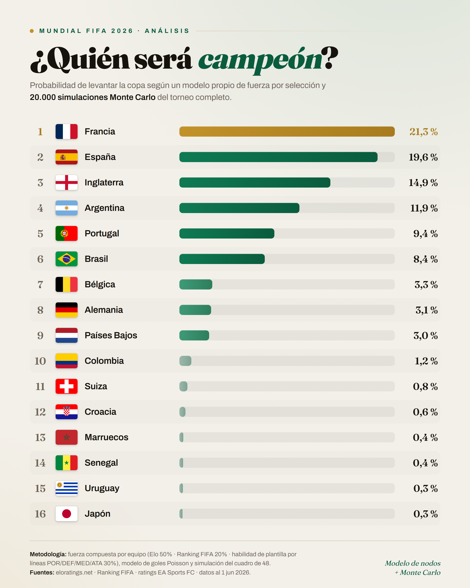
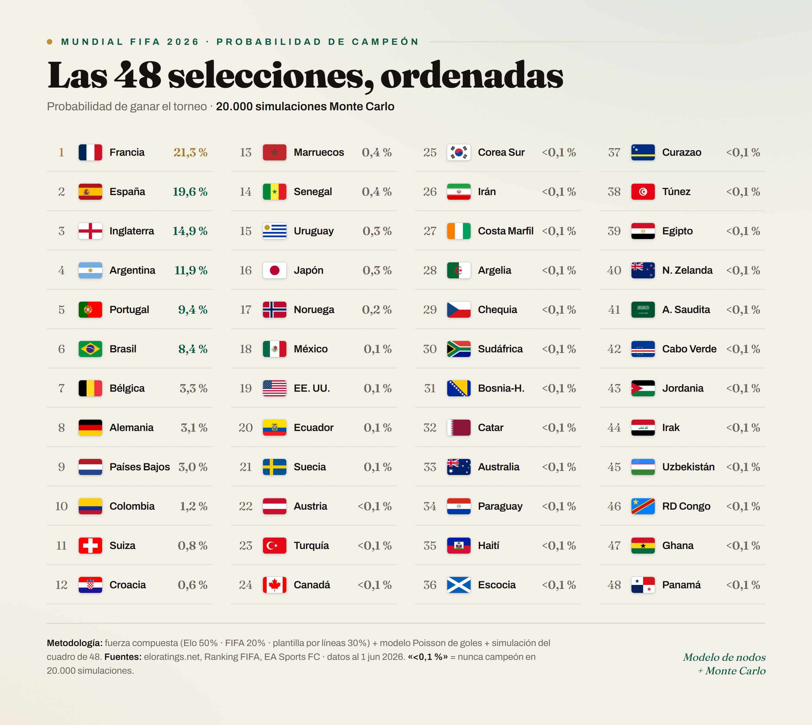

<div align="center">

# ⚽ Mundial 2026 — Modelo de Quiniela

### ¿Quién será campeón? Un modelo estadístico propio que convierte a las 48 selecciones en nodos de fuerza y simula el torneo completo **20.000 veces** con Monte Carlo.

[](https://www.python.org/)
[](#-tests)
[](#-resultados)
[](LICENSE)

</div>

---

## 🏆 Resultados

> Probabilidad de levantar la copa según un modelo de **fuerza compuesta por selección**
> (Elo + ranking FIFA + plantilla) y **20.000 simulaciones Monte Carlo** del torneo completo.
> Datos al 1 jun 2026.

<div align="center">



</div>

| # | Selección | P(campeón) | # | Selección | P(campeón) |
|--:|-----------|-----------:|--:|-----------|-----------:|
| 1 | 🇫🇷 Francia    | **21,3 %** | 6 | 🇧🇷 Brasil       | 8,4 % |
| 2 | 🇪🇸 España     | **19,6 %** | 7 | 🇧🇪 Bélgica      | 3,3 % |
| 3 | 🏴 Inglaterra | **14,9 %** | 8 | 🇩🇪 Alemania     | 3,1 % |
| 4 | 🇦🇷 Argentina  | **11,9 %** | 9 | 🇳🇱 Países Bajos | 3,0 % |
| 5 | 🇵🇹 Portugal   | **9,4 %**  |10 | 🇨🇴 Colombia     | 1,2 % |

<div align="center">

### Las 48 selecciones, ordenadas



</div>

> 💡 Ningún favorito supera el ~21 %. Es lo que dice también el mercado de apuestas:
> en un torneo de 48 equipos a partido único en eliminatorias, **la incertidumbre manda**.

---

## 🧠 Cómo funciona

El modelo transforma cada selección en un **nodo con una fuerza compuesta `R`** y deja que el
torneo se juegue solo, miles de veces.

```
ratings.csv  ──►  fuerza compuesta R  ──►  modelo de partido (Poisson)  ──►  Monte Carlo  ──►  P(campeón)
 (48 equipos)      Elo·FIFA·plantilla       goles esperados + V/E/D         20.000 torneos     + gráficas
```

1. **Datos** — los 12 grupos del sorteo (5 dic 2025) son un hecho fijo; el resto de señales
   (Elo, ranking FIFA, atributos de plantilla) se ensamblan en `data/processed/ratings.csv`.
2. **Fuerza compuesta `R`** — cada señal se estandariza (z-score), se mezcla con los pesos de
   `config.yaml` y se reescala a escala Elo (~1500–2150). Las plantillas aportan las unidades
   **POR / DEF / MED / ATA**.
3. **Modelo de partido (Poisson)** — de las fuerzas efectivas de ataque y defensa salen los goles
   esperados, la matriz de marcadores, las probabilidades de victoria/empate/derrota y el marcador
   más probable.
4. **Simulación Monte Carlo** — round-robin de grupos con desempates FIFA, selección de los 8
   mejores terceros, cuadro de Ronda de 32 y 20.000 torneos completos.
5. **Salidas** — tabla de probabilidades, gráficas editoriales y grafo de fuerza por grupos.

---

## 🚀 Inicio rápido

```bash
# 1. Instalar dependencias (Python 3.11+)
pip install -r requirements.txt

# 2. Correr el pipeline completo: ratings → Monte Carlo → outputs/
python -m src.run_pipeline

# 3. (opcional) Suite de tests
python -m pytest -q
```

El pipeline imprime el top 20 de favoritos y escribe en `outputs/`:
- `probabilidades_campeon.csv` — las 48 probabilidades (suman ~1)
- `favoritos.png` — gráfico de barras de los favoritos

---

## 🎯 Análisis partido a partido

Lo que se usa **cada jornada** del torneo para la quiniela:

```bash
python -m src.predict --home "Mexico" --away "Korea Republic" --home-venue
```

Usa `--home-venue` cuando el local juega en sede anfitriona (US/MX/CA). Salida:

```
Mexico vs Korea Republic
  P(victoria Mexico):         52 %
  P(empate):                  24 %
  P(victoria Korea Republic): 24 %
  Goles esperados:            1.6 - 1.1
  Marcador más probable:      1-1
```

> Los nombres van **en inglés**, exactamente como en `src/teams.py`
> (p. ej. `"Korea Republic"`, `"Turkiye"`, `"Congo DR"`).

---

## ⚙️ Configuración

Todo el modelo se ajusta desde `config.yaml`, sin tocar código:

| Bloque | Qué controla |
|---|---|
| `weights` | Peso de cada señal en `R` (`elo` 0.50 · `fifa` 0.20 · `players` 0.30) |
| `goals` | Modelo Poisson: `base_mu`, `beta`, `home_boost`, `unit_weight`, `max_goals` |
| `simulation` | Nº de simulaciones (`n_sims`) y semilla (`seed`) — resultados reproducibles |

**Calibración:** `beta = 0.40`. Con el valor inicial (0.85) la distribución se concentraba de forma
irreal (favorito al 34 %); con 0.40 el favorito queda en ~21 %, coherente con las casas de apuestas.

---

## 🗂️ Arquitectura

| Módulo | Responsabilidad |
|---|---|
| `src/teams.py` | 12 grupos × 4 equipos, nombres canónicos, sedes anfitrionas |
| `src/ratings.py` | z-score, fuerzas de unidad, fuerza compuesta `R` |
| `src/match_model.py` | Goles esperados, matriz de marcadores, P(V/E/D), marcador más probable |
| `src/simulate.py` | Round-robin, tabla de grupo, mejores terceros, KO, Monte Carlo |
| `src/bracket_2026.py` | Cuadro de Ronda de 32 (slots y asignación de terceros) |
| `src/network.py` | Grafo de fuerza (networkx) + visualización |
| `src/predict.py` | CLI de análisis por-partido |
| `src/report.py` | Tablas y figuras de salida |
| `src/run_pipeline.py` | Orquestador del pipeline completo |
| `tests/` | 26 tests unitarios (uno por módulo) |

---

## ⚠️ Caveats

- **Mejores terceros:** la asignación exacta de los 8 mejores terceros a los huecos del cuadro
  depende del Anexo C de FIFA (495 combinaciones) y solo se fija con resultados reales. Aquí se usa
  una **aproximación documentada**; su efecto sobre la probabilidad de campeón es de segundo orden.
- **Desempates de grupo:** puntos → diferencia de goles → goles a favor. Se omiten enfrentamiento
  directo y fair play (impacto marginal).
- **Modelo de goles:** Poisson independiente. El ajuste Dixon-Coles queda como mejora posterior.
- **Datos:** verificar los Elo de los top contra una fuente autoritativa (eloratings.net / Wikipedia)
  antes de re-correr con datos nuevos.

---

## 🧪 Tests

```bash
python -m pytest -q   # 26 passed
```

TDD: cada módulo tiene su test en `tests/`. Mantener verde antes de commitear.

---

<div align="center">

**Hecho por Ricardo Puente** · Modelo de nodos + Monte Carlo

[](https://www.linkedin.com/in/ricardo-puente1)
[](https://github.com/rpuenteaddiuva)

Fuentes: eloratings.net · Ranking FIFA · ratings EA Sports FC

</div>
